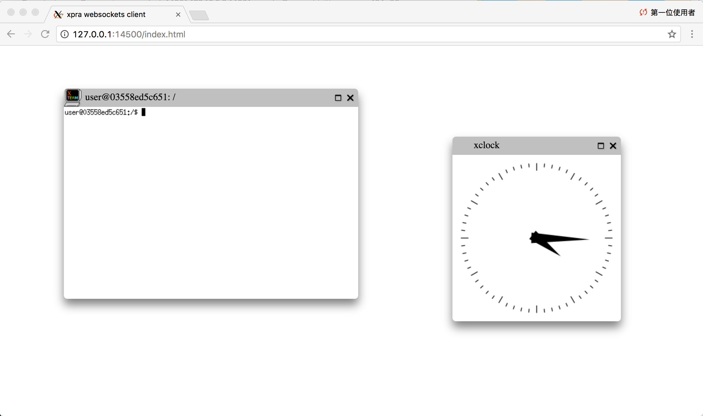

# dockerui.base-xpra

Provides base docker images for X applications by using [Xpra](https://xpra.org/) as the X11 server.


### Supported tags and respective `Dockerfile` links

* [`2.0-hf1-jessie`, `2.0-jessie`, `latest-jessie` (Dockerfile-jessie)](https://github.com/mgtsai/dockerui.base-xpra/blob/v2.0-hf1/Dockerfile-jessie): Xpra version 2.0-r15315M-1 based on Debian Jessie

* [`2.0-hf1-xenial`, `2.0-xenial`, `latest-xenial` (Dockerfile-xenial)](https://github.com/mgtsai/dockerui.base-xpra/blob/v2.0-hf1/Dockerfile-xenial): Xpra version 2.0-r15319-1 based on Ubuntu Xenial (16.04)


## A Got-a-feeling Example

Type the following command:

```
> docker run --rm --env XPRA_OPTIONS="--exit-with-children --bind-tcp=0.0.0.0:14500 --html=on" --publish 14500:14500 mgtsai/dockerui.base-xpra:latest-jessie sh -c "xclock & xterm"
```

and then browse <http://yourhost:14500/>.  Oh yeah!  An `xclock` and an `xterm` are shown on the web browser.




## Basic Concepts

#### Running X applications in a Docker container

Users can use `docker create` or `docker run` to execute the specified X application in the created container, similar to other typical non-GUI commands running in containers.  The X application communicates to the Xpra server with the environment variable `DISPLAY=:0`, by the UNIX domain socket `/tmp/.X11-unix/X0`, which means only local X applications are allowed to connect to the Xpra server, but remote applications are prohibited.

In the provided images, only few simple X applications are pre-installed, such as `xclock`, `xterm`, ... etc.  Typically one user builds his/her own `Dockerfile` by inheriting one of the provided images of this project, and install the wished GUI program specified in the `Dockerfile`.  The following `Dockerfile` example provides the execution of X file manager `Xfe`:

```dockerfile
FROM mgtsai/dockerui.base-xpra:latest-jessie
RUN apt-get update && apt-get install -q -y xfe
ENV XPRA_OPTIONS="--exit-with-children --bind-tcp=0.0.0.0:14500"
EXPOSE 14500
CMD xfe
```


#### Xpra startup options

By default, the Xpra server only provides UNIX domain sockets for Xpra client connections.  To enable remote client connection via network, the Docker environment variable `XPRA_OPTIONS` is applied when creating containers, incorporated in the following Xpra startup command:

```
xpra start $DISPLAY --no-daemon $XPRA_OPTIONS --start-child="$CMD"
```

For example, applying `XPRA_OPTIONS="--bind-tcp=0.0.0.0:14500"` means Xpra clients can connect to the server via the insecure TCP port 14500.

Otherwise, users can specify the Xpra option `--exit-with-children` in `XPRA_OPTIONS` to enable automatically terminating while the X application terminates.

For detailed usage of Xpra options, you may reference <http://xpra.org/manual.html>.


#### Specifying effective UID and GID of the Xpra server and X appications

In some scenarios, we would like to specify the application's effective UID/GID, especially when working with Docker volumes.  For example, an IDE program works with user's development project sources, and the whole bunch of source files may be preferred to be located on the host file system, by binding host directories with container volumes.  Since the files on the host file system have their own UID/GID which should not be altered inside the container, we need to specify the effective UID/GID of the running X application (a.k.a. IDE programs) to assign the right permission to access the cooperative files.

We let the determination of the effective UID/GID of an X application being lately bound on the Docker container creating phase (not on the image building phase) to provide more flexibility for users.  While creating a Docker container, applying environment variables `GUEST_USER`, `GUEST_GROUP`, `GUEST_UID`, `GUEST_GID` for specifying user/group names and effective UID/GID of the Xpra server and X applications.

When starting a container, it also creates the corresponding home directory of `GUEST_USER`.  The home directory is specified by the environment variable `GUEST_HOME`, with default value `"/home/$GUEST_USER"`.  Thus, the X application knows the information of which user runs it and its home directory, similar to ones run on a normal physical/virtual machine.


#### Container startup execution sequence

Despite of regular Docker command running as specified `GUEST_UID`/`GUEST_GID`, sometimes we wish to do extra operations with root permission.  When building user's own `Dokerfile`, the script `/docker/preexecAsRoot` is used for this purpose.  Before starting the Xpra server, `/docker/preexecAsRoot` is executed with root permission for initializing necessarities, such as other cooperative daemons.

Briefly, when a container start, the following sequence would be executed:

1. `/docker/preexecAsRoot` with effective UID/GID as 0/0
2. Starts the Xpra server with `GUEST_UID`/`GUEST_GID`
3. Runs the specified X application with `GUEST_UID`/`GUEST_GID`


#### Default values of environment variables

Environment variable | Default value
---------------------|--------------
GUEST_USER           | user
GUEST_GROUP          | user
GUEST_UID            | 9001
GUEST_GID            | 9001
GUEST_HOME           | /home/$GUEST_USER
DISPLAY              | :0
XPRA_OPTIONS         |


#### Secure communications

* (TBD)


## Examples

* Runs `xlock` as well as the Xpra server by providing TCP port 14500 (INSECURE)

```
> docker run --rm --env XPRA_OPTIONS="--exit-with-children --bind-tcp=0.0.0.0:14500" mgtsai/dockerui.base-xpra:latest-jessie xclock
```


* Runs `xeyes` as well as the Xpra server with UID 2001 and GID 2001 by providing TCP port 14500 (INSECURE)

```
> docker run --rm --env XPRA_OPTIONS="--exit-with-children --bind-tcp=0.0.0.0:14500" --env GUEST_UID=2001 --env GUEST_GID=2001 mgtsai/dockerui.base-xpra:latest-jessie xeyes
```


* Runs `xcalc` as well as the Xpra server by providing TCP port 14500 and HTTP server with URL <http://container:14500/index.html> (INSECURE) for showing `xcalc`

```
> docker run --rm --env XPRA_OPTIONS="--exit-with-children --bind-tcp=0.0.0.0:14500 --html=on" mgtsai/dockerui.base-xpra:latest-jessie xcalc
```


* Runs `xedit` as well as the Xpra server by providing TCP port 14500 with password authentication (INSECURE)

```
> docker run --rm --env XPRA_OPTIONS="--exit-with-children --bind-tcp=0.0.0.0:14500 --auth=password:value=yourpass" mgtsai/dockerui.base-xpra:latest-jessie xedit
```


* Runs `xterm` as well as the Xpra server by providing TCP port 14500 with SSL and password authentication, using `./demofiles/cert/demo.pem` on host as SSL certification

```
> docker run --rm --env XPRA_OPTIONS="--exit-with-children --bind-ssl=0.0.0.0:14500 --ssl-cert=/home/user/demofiles/cert/demo.pem --auth=password:value=yourpass" --volume `pwd`/demofiles:/home/user/demofiles mgtsai/dockerui.base-xpra:latest-jessie xterm
```


* More `Dockerfile` examples are provided in the directory `examples/`
